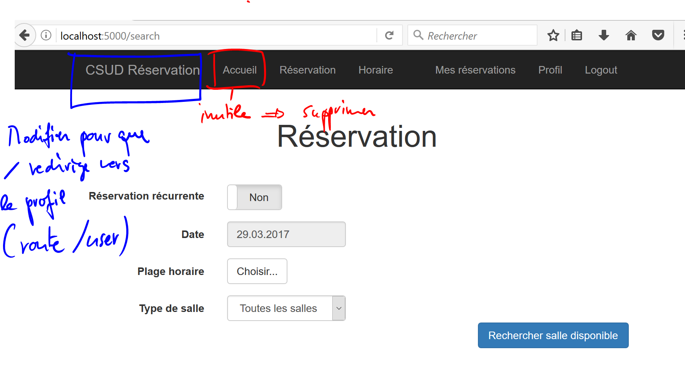
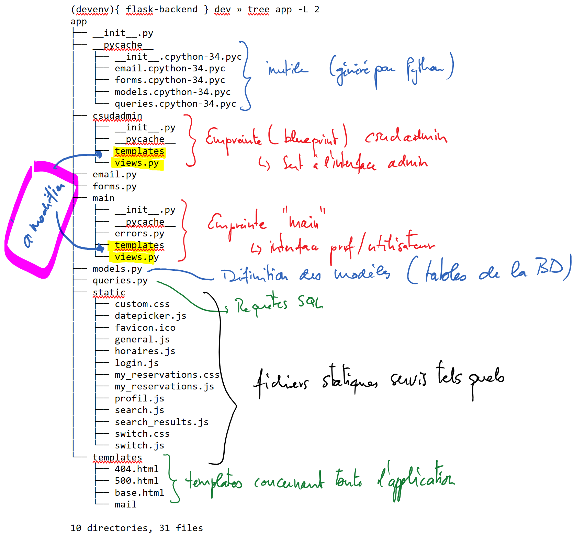
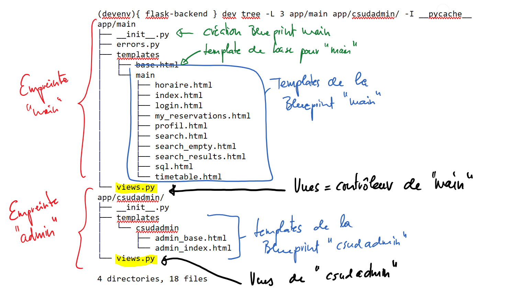

###################
Consignes de projet
###################

Étape 0 : mise en place du projet
==================================

#.  Créer un compte GitHub si cela n'est pas déjà fait

#.  Créer un nouvel environnement Cloud9 de type Python

#.  Saisir la commandes suivante dans le terminal

    ..  code-block:: bash

        curl https://raw.githubusercontent.com/csud-reservation/flask-backend/dev/prepare-c9.sh | sh

..  tip::

    La commande précédente utilise ``curl`` pour effectuer une requête HTTP GET sur l'URL https://raw.githubusercontent.com/csud-reservation/flask-backend/dev/prepare-c9.sh, ce qui a pour effet de récupérer le contenu du fichier qui est ensuite redirigé (pipe) dans la commande ``sh`` qui va exécuter les commandes contenues dans le fichier téléchargé, comme si ces dernières avaient été tapées en ligne de commande dans le terminal.

..  warning::

    Remarquez que la commande 

    ::

        git checkout -t origin/dev

    a pour effet de passer à la branche ``dev`` du dépôt puisqu'on est en mode développement, afin de ne pas toucher à la branche ``master`` qui est la version de production fonctionnelle.

Redirection vers le profil utilisateur
================================================

Effectuer les changements suivants sur la page d'accueil.

    Changements à apporter à la page d'accueil

#.  Pour le moment, lorsque l'utilisateur se connecte et visite la route ``/``, il est redirigé vers le profil utilisateur ``/user``. Modifier l'empreinte flask ``main`` pour que lorsqu'on entre la route ``/``, on soit redirigé vers la page permettant d'effectuer une réservation.

    ..  tip::

        #.  Observer le fichier ``main/views.py`` pour savoir quelle fonction (vue) est utilisée lorsqu'on visite ``/``

        #.  Modifier cette vue pour rediriger vers la bonne route

#.  Supprimer intelligemment le bouton "Accueil" qui ne sert à rien.

    ..  tip::

        Toutes les pages ont le même look car tous les templates sont basés sur le fichier ``templates/base.html``. C'est dans ce fichier qu'il faut aller apporter la modification pour qu'elle se répercute sur toutes les pages.

..  warning:: 

    Lorsque tout est fonctionnel, vérifier les différences avec 

    ::

        git diff HEAD^

    et valider les changements avec

    ::

        git add .
        git commit -m "step 1"

    ou, pour faire bref, 

    ::

        git commit -am "modifications page d'accueil"

Comprendre la structure de l'application
==================================================

..  tip::

    La commande ``tree`` permet de visualiser l'arborescence d'un dossier. L'option ``-L <niveau>`` permet d'indiquer la profondeur de la visualisation

Pour commencer à travailler dans le projet, il faut en comprendre la structure générale. En principe, il ne faut toucher que les fichiers / dossiers au stabylo.

    Structure des fichiers

..  warning::

    Les personnes qui ont déjà travaillé sur le projet doivent prendre garde à l'emplacement des templates qui a été modifié. Chaque empreinte (Blueprint) définit maintenant ses propres templates dans le sous-dossier ``templates``

Voici en particulier la structure des "empreintes" ``main`` et ``csudadmin`` qui regroupent les fichiers à modifier dans ce TP. En principe, il n'est pas nécessaire de modifier des fichiers en dehors des empreintes.

    Structure des empreintes (Blueprints)

Étudier le fichier ``models.py`` et le schéma relationnel
===================================================================

Les modèles représentent les données qui sont stockées dans la base de données, sous forme de classe. Chaque classe correspond à une table dans la base de données dont la structure est explicitée sous :ref:`db-schema`.

Lien GitHub du fichier : https://github.com/csud-reservation/flask-backend/blob/dev/app/models.py

Faire des requêtes sur la base de données
=========================================

Pour accéder à la base de données SQLite, il y a plusieurs solutions.

Accès à la base de données avec la DB-API
-----------------------------------------

La première consiste à accéder directement à la base de données par la DB API,
comme nous l'avions vu dans le chapitre sur les bases de données
(http://oci.donner-online.ch/files-db/db-api/sqlite-api-theorie.html).

Accès à la base de données par SQLAlchemy
-----------------------------------------

En général, au lieu d'accéder à la base de données par la DB-API, on uilise
l'ORM (Object Relational Mapper) SQLAlchemy.

..  tip::

    L'avantage de SQLAlchemy est qu'il n'est pas nécessaire de former des
    requêtes SQL dans le code Python, ce qui évite d'ailleurs des tas de risques
    de sécurité (injections de SQL). C'est souvent beaucoup plus simple car on
    peut utiliser une logique objet familière à Python au lieu d'utiliser le
    concept des tables du modèle relationnel.

    Le gros désavantage de cette technique est qu'il y a une couche de plus à
    maîtriser et à apprendre pour bien comprendre l'application.

Pour expérimenter avec cette technologie, vous pouvez faire (s'assurer que
l'environnement virtuel soit activé !!!)

::

    pip install ipython
    python manage.py shell

Cela va charger un terminal dans lequel vous pouvez entrer des commandes

..  code-block:: python

    >>> User
    app.models.User

    >>> User.query.filter_by(sigle='DONC')
    <flask_sqlalchemy.BaseQuery at 0xfe5f2e70>

    >>> User.query.filter_by(sigle='DONC').first()
    <User 44, 'DonnerC@edufr.ch'>

    # tous les jours de la semaine
    >>> Weekday.query.all()
    [<Weekday id=1, name='Lundi'>,
    <Weekday id=2, name='Mardi'>,
    <Weekday id=3, name='Mercredi'>,
    <Weekday id=4, name='Jeudi'>,
    <Weekday id=5, name='Vendredi'>,
    <Weekday id=6, name='Samedi'>,
    <Weekday id=7, name='Dimanche'>]

    # parcourir les jours de la semaine dans une boucle for
    >>> for d in Weekday.query.all():
   ...:     print(d.name)
   ...:
    Lundi
    Mardi
    Mercredi
    Jeudi
    Vendredi
    Samedi
    Dimanche

Utiliser du code SQL pur (raw SQL)
----------------------------------

Il est également possible de travailler directement en SQL, dans le dialecte SQL
de la base de données cible (ici MySQL).

..  warning::

    Cela est à éviter si possible pour éviter des problème lors de la migration
    vers la base de données de production. Il ne faut utiliser cette technique
    que lorsque l'on ne voit pas comment se servir de SQLAlchemy.

Pour effectuer le traitement des données ``result`` retournées par cette
méthode, on peut utiliser une boucle ``for`` pour parcourir ``result`` comme
dans l'exemple que l'on trouve dans ``app/main/views.py``. On récupère alors un
générateur de tuples comme le montre l'exemple suivant :

..  code-block:: python

    >>> result = db.engine.execute('SELECT * FROM weekdays')

    >>> for row in result: print(row)
    (1, 'Lundi')
    (2, 'Mardi')
    (3, 'Mercredi')
    (4, 'Jeudi')
    (5, 'Vendredi')
    (6, 'Samedi')
    (7, 'Dimanche')

En fait, les éléments de ``result`` ne sont pas vraiment des tuples et
fonctionnent un peu comme des dictionnaires comme le montre l'exemple suivant :

..  code-block:: python

    >>> result = db.engine.execute('SELECT * FROM weekdays')

    >>> for row in result: print(row['name'])
    Lundi
    Mardi
    Mercredi
    Jeudi
    Vendredi
    Samedi
    Dimanche

..  tip::

    Plusieurs exemples de telles requêtes se trouvent dans ``app/queries.py`` (https://github.com/csud-reservation/flask-backend/blob/dev/app/queries.py#L17).
    
Voici par exemple la requête qui permet de rechercher les disponibilités des
salles dans la base de données :

..  code-block:: python

    def search_query(weekday_id, first_period, last_period, current_date, room_type):
        '''
        Retourne toutes les salles disponibles à la date donnée
        '''
        
        # la réservation récurrente ne fonctionne pas, puisque nous utilisons deux fois "current_date"
        data = [weekday_id, first_period, last_period, current_date, current_date, room_type]
        #print (data)

        
        result = db.engine.execute(
            ''' SELECT rooms.name 
                FROM rooms
                WHERE rooms.id NOT IN
                    (SELECT rooms.id
                    FROM rooms
                    LEFT JOIN reservations
                        ON reservations.room_id = rooms.id
                    LEFT JOIN reservations_timeslots
                        ON reservations.id = reservations_timeslots.reservation_id
                    WHERE reservations.weekday_id = ?
                        AND reservations_timeslots.timeslot_id BETWEEN ? AND ?
                        AND reservations.start_date <= ?
                        AND reservations.end_date >= ?)
                AND rooms.name LIKE ?;
                ''', data)
        
        return result

..  tip::

    On voit que la requête comprend des points d'interrogation ``?`` permettant de
    substituer les valeurs qui sont fournies en argument à la méthode
    ``db.engine.execute()``. En l'occurrence, chaque point d'interrogation de la
    requête est remplacé par un des éléments de la liste ``data`` dans leur
    ordre d'apparition dans la liste.

Requêtes SQL Pythonesques
-------------------------

Il est même possible d'utiliser une sorte de voie médiane entre le SQL brut et
le style ORM : le "SQL Expression language". Voici un exempe tiré de ``main/views.py``

..  code-block:: python
    :emphasize-lines: 7-8
    :linenos:

    @main.route('/user', methods=['GET', 'POST'])
    @login_required
    def profil():
        
        session['CombinationPP'] = 0
        changePWForm = ChangePasswordForm()
        query = select(['*']).where(User.id == current_user.id)
        result = db.session.execute(query).first()

..  tip::

    Documentation pour cette manière de faire des requêtes : http://docs.sqlalchemy.org/en/latest/core/tutorial.html

Étape 4 : Étudier le fichier ``app/csudadmin/__init__.py``
==========================================================

#.  Expliquer précisément ce que fait ce fichier

#.  À quelle route (URL) correspond la vue ``csudadmin.index`` ?

Étape 5 : 